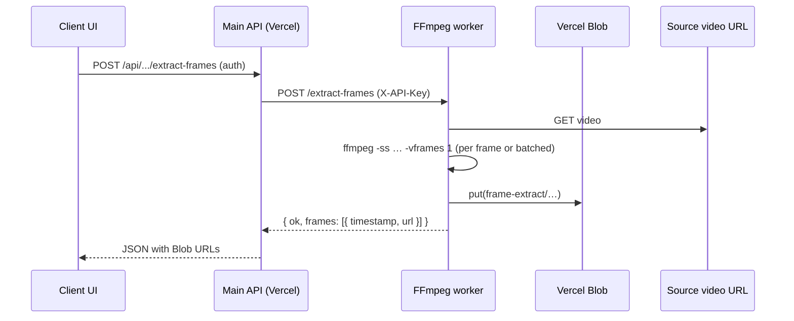

# Frame extractor tool — implementation plan

> **Status:** Planning only — not implemented yet.  
> **Intent:** Robust server-side video frame extraction using the **existing ffmpeg worker**, with outputs stored on **Vercel Blob** (not R2 presign for outputs).

---

## 1. Goals

- Let users (or admins) extract one or more still frames from a video at chosen timestamps.
- Run all heavy work on the **ffmpeg worker** (Hetzner / long-lived Node + ffmpeg), not on Vercel serverless.
- Persist results on **Vercel Blob** with a dedicated path prefix and stable HTTPS URLs.
- Fit existing security patterns: API key to worker, auth on main app, rate limits, optional credits.

---

## 2. Current state (repo)

| Piece | Location | Relevance |
|--------|-----------|-----------|
| Frame extraction (local ffmpeg + R2) | `src/services/video.service.js` — `extractFramesFromVideo`, `extractFrameFromVideo` | **Not** the target path for this tool; uses app-local ffmpeg and R2 upload. |
| Worker client | `src/services/ffmpeg-worker-client.js` — `postTranscodeJobToWorker`, `postRepurposeJobToWorker` | Extend with e.g. `postExtractFramesJobToWorker` or reuse pattern. |
| Worker HTTP | `ffmpeg-worker/server.js` — `POST /transcode`, `POST /job` | `/transcode` → presigned PUT only (R2-style). `/job` supports **Blob** via `vercelBlobOutput` + `outputBlobPrefix` + `BLOB_READ_WRITE_TOKEN`. |
| Blob on worker | Same file — `uploadOutputsToVercelBlob`, `BLOB_PREFIX_RE` | Today prefix is restricted to **`content-studio/...`**. Frame tool needs an **additional allowed prefix** (e.g. `frame-extract/`). |
| Kie upload / app Blob | `src/utils/kieUpload.js`, admin tutorial flows | Reference for `put()` patterns; worker already imports `@vercel/blob`. |

---

## 3. Target architecture



- **Main app** validates user, optional credits, builds worker payload (input URL, timestamps, prefix segment).
- **Worker** downloads once, runs ffmpeg, uploads JPEG/PNG to Blob, returns public URLs.
- **No** requirement for the main app to run ffmpeg or hold large video buffers beyond proxying the request.

---

## 4. FFmpeg worker changes (`ffmpeg-worker/server.js`)

### 4.1 New endpoint (recommended): `POST /extract-frames`

**Why not only extend `/transcode`:** Single-output transcode builds args as `-i` then `-vf`; for extraction, **`-ss` before `-i`** is preferred for fast seek. Multi-frame output is clearer as a dedicated handler.

**Proposed body (shape — finalize in implementation):**

```json
{
  "inputUrl": "https://…",
  "timestamps": [0, 3.5, 10],
  "format": "jpeg",
  "quality": 2,
  "maxEdge": 1920,
  "outputBlobPrefix": "frame-extract/<userId-or-job>/<uuid>",
  "jobRef": "optional-correlation-id"
}
```

**Worker behavior:**

1. Validate `inputUrl` (https, reasonable length).
2. Enforce **max frames** (e.g. 20) and **max timestamps** within duration (optional: ffprobe first for duration cap).
3. `downloadToFile(inputUrl)` once into temp dir.
4. For each timestamp (or batch with `select` filter — optimize later):
   - Run ffmpeg e.g. `-y -ss <t> -i <input> -vframes 1 -q:v <quality> [-vf scale=…] <out>.jpg`
5. Upload each file with `@vercel/blob` `put()`, pathname under `outputBlobPrefix` (must pass allowlist).
6. Respond `{ ok: true, frames: [{ timestamp, url }], duration?: number }` or `{ ok: false, message }`.

**Env (worker):**

- `BLOB_READ_WRITE_TOKEN` — required for Blob outputs.
- `FFMPEG_WORKER_API_KEY` — unchanged.
- Optional: `FRAME_EXTRACT_MAX_FRAMES`, `FRAME_EXTRACT_MAX_VIDEO_SECONDS`.

### 4.2 Blob prefix allowlist

- Extend validation beyond `content-studio/` to include e.g. **`frame-extract/`** (regex: `^frame-extract/[a-zA-Z0-9/_\-]+$` or stricter).
- Reject any prefix that does not match allowlist to prevent arbitrary Blob writes.

### 4.3 Mirror in `ffmpeg-worker-deploy/` (if used)

- If production deploys from `ffmpeg-worker-deploy/`, duplicate or symlink server changes there per your deploy process (see `docs/MODELCLONE_FFMPEG_WORKER_CLIENT.md` / `DEPLOY_RAILWAY_HETZNER_FFMPEG.md`).

### 4.4 Health / index

- Update `GET /` JSON to list `POST /extract-frames`.

---

## 5. Main application changes

### 5.1 Client helper

- File: `src/services/ffmpeg-worker-client.js`
- Add `postExtractFramesJobToWorker(body)` → `postToWorker("extract-frames", body)` with same timeout and multi-base URL behavior as existing helpers.

### 5.2 API route

- New route e.g. `POST /api/tools/extract-frames` or under `video-repurpose` / `generate` depending on product.
- **Auth:** `authMiddleware` (and optionally `adminMiddleware` for v1).
- **Body:** `{ videoUrl, timestamps: number[] }` or `{ videoUrl, count }` with evenly spaced times (product choice).
- **Validation:**
  - URL must be https; optionally restrict to same-origin Blob/R2 URLs your app already issued (reduces abuse).
  - Clamp count and timestamps server-side even if worker also clamps.
- **Flow:** Build `outputBlobPrefix` = `frame-extract/<userId>/<shortId>` (or `jobId`), call worker, return `{ success, frames }`.
- **Errors:** Map worker failures to 502/400 with safe messages.

### 5.3 Credits / pricing (optional)

- If this is a paid feature: integrate `getGenerationPricing` or a new key (e.g. `frameExtractPerFrame`), deduct before calling worker, refund on worker failure (same patterns as generations).

### 5.4 Rate limiting

- Reuse existing limiter middleware or add a dedicated limit for this path (per user / IP).

---

## 6. Storage (Vercel Blob)

- **Prefix:** `frame-extract/{userId}/{batchId}/frame_0.jpg` …
- **Access:** `public` (same as other tool outputs) unless you need private + signed URLs later.
- **Lifecycle:** Document whether blobs are retained forever or cleaned up by a future job (out of scope for v1 unless required).

---

## 7. UI (deferrable)

- **Placement options:** Generate page (sidebar tool), Creator Studio, Admin-only beta, or standalone `/tools/frame-extract`.
- **Minimal UX:** Paste or select video URL (or upload → existing flow → Blob URL), numeric time(s) or simple slider, “Extract”, grid of results + copy URL / download.
- **Progress:** Worker could support `progressUrl` later (like `/job`); v1 can be synchronous HTTP wait with client spinner (subject to timeout — align with `WORKER_JOB_TIMEOUT_MS`).

---

## 8. Security & abuse

- Authenticated users only (or admin-only for first ship).
- Cap frames per request and video length (ffprobe on worker).
- Prefer accepting only **your** Blob/R2 URLs for `inputUrl` if the video is always uploaded through your app first.
- Log `userId`, `inputUrl` host, frame count, duration for support and cost review.

---

## 9. Testing checklist

- [ ] Worker: single timestamp, multiple timestamps, very short video, timestamp past end (define behavior: clamp or error).
- [ ] Worker: invalid URL, ffmpeg failure, missing `BLOB_READ_WRITE_TOKEN`.
- [ ] Prefix rejection: `outputBlobPrefix` not in allowlist → 400.
- [ ] API: unauthenticated → 401; rate limit → 429.
- [ ] End-to-end: real production worker URL + token from staging.

---

## 10. Rollout phases

| Phase | Scope |
|-------|--------|
| **P0** | Worker `POST /extract-frames` + Blob allowlist prefix + app `postExtractFramesJobToWorker` + authenticated API returning URLs. |
| **P1** | UI + optional credits + stricter URL allowlist. |
| **P2** | Progress callbacks, batch jobs, cleanup policy, sharpness ranking (port logic from `video.service.js` if desired — may stay worker-side with `sharp` if installed). |

---

## 11. Open decisions

- **Who can use it:** all logged-in users vs admin-only for v1?
- **Input source:** any public HTTPS URL vs only URLs from your storage?
- **Output format:** JPEG only vs JPEG + PNG?
- **Sync vs async:** if videos are long, consider queue + webhook callback like `/job` instead of holding HTTP open.
- **Deploy artifact:** single repo path for worker (`ffmpeg-worker/` vs `ffmpeg-worker-deploy/`) — align with ops.

---

## 12. Related docs

- `docs/MODELCLONE_FFMPEG_WORKER_CLIENT.md` — app ↔ worker client.
- `docs/DEPLOY_RAILWAY_HETZNER_FFMPEG.md` — deployment topology.
- `docs/FFMPEG_WORKER_CALLBACK.md` — callbacks (if async phase).

---

*Last updated: planning draft for future implementation.*
